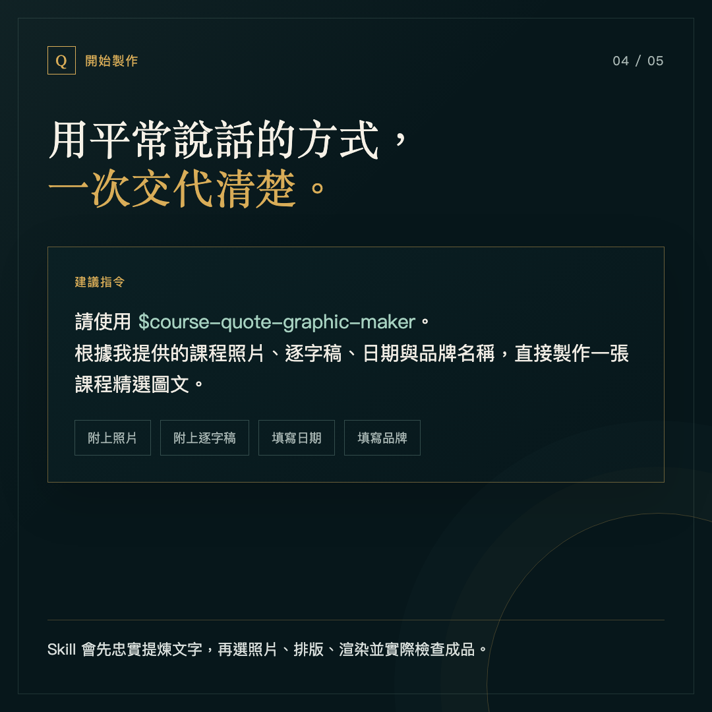

# 課程圖文製作 Skill


把一張課程現場照片和一份逐字稿，整理成可直接發布的高解析精選圖文。

這個 Skill 會替你完成四件事：讀懂逐字稿、挑出核心觀點、保留現場照片的真實性、依固定版型輸出 `2048 × 1152` PNG。

## 一分鐘安裝

在 Codex 貼上這句話：

```text
請幫我安裝這個 Skill：
https://github.com/Roger0202-x/course-quote-graphic-maker/tree/main/skills/course-quote-graphic-maker
```

安裝完成後，重新開啟 Codex，讓新 Skill 載入。


## 使用前準備

每次準備四樣資料：

1. 一張或多張課程照片
2. 該堂課的逐字稿
3. 課程實際日期
4. 品牌或系列名稱，可省略


## 直接這樣說

```text
請使用 $course-quote-graphic-maker。
根據我提供的課程照片、逐字稿、日期與品牌名稱，
直接製作一張課程精選圖文。
```

接著把照片與逐字稿一起附上即可。



## 它會怎麼工作

1. 完整閱讀逐字稿，不自行增加講者沒說過的觀點
2. 提煉一個核心主句與簡短延伸內容
3. 選擇表情自然、清楚且有文字空間的照片
4. 使用左文右人的固定構圖，避免蒙板壓暗人物
5. 輸出 `16:9`、`2048 × 1152` 的高解析 PNG
6. 實際檢查文字、日期、人物與檔案尺寸後再交付


## 固定品質規則

- 保留講者原意，不為了文學感扭曲內容
- 不改變人物五官、年齡、服裝、姿勢與現場文字
- 不覆蓋原始照片
- 日期固定使用 `YYYY.MM.DD`
- 左上角只顯示品牌或系列名稱
- 不在圖面加入堂次、時段、人物角色或姓名
- 正式成品必須實際開啟檢查

完整規格請見 [製作 SOP](skills/course-quote-graphic-maker/references/sop.md)。

## 品牌名稱可以更換

這是可公開使用的通用版。你可以填入自己的品牌或系列名稱；沒有提供時，預設顯示「課程精選」。

## 隱私說明

這個公開專案不含任何真實課程照片、私人逐字稿、客戶名稱、帳號、密碼或本機路徑。圖像合成程式本身沒有把素材上傳到第三方網站的功能，正式排版與輸出在本機完成。

逐字稿理解與文字提煉仍會由你正在使用的 Codex 模型處理，因此資料適用你所使用帳號與工作環境的資料政策。機密課程內容請依組織規範判斷是否能交給 AI 處理。

## 專案裡有什麼

| 內容 | 用途 |
| --- | --- |
| `SKILL.md` | 告訴 Codex 何時啟動與如何執行 |
| `references/sop.md` | 內容、照片、版型與驗收規格 |
| `scripts/build_course_graphic.mjs` | 將設定、照片與版型輸出為 PNG |
| `assets/course-graphic-template.html` | 固定視覺版型 |
| `agents/openai.yaml` | Codex 內的名稱與預設指令 |
| `.codex-plugin/plugin.json` | 外掛基本資料 |

完整公開範圍與排除項目請見 [公開內容核對表](PUBLICATION-CHECKLIST.md)。

## 範例資料

[範例設定](examples/example-config.json) 與 [範例逐字稿](examples/example-transcript.txt) 只用來示範欄位，不含真實人物或客戶資料。

## 授權

本專案採用 [MIT License](LICENSE)，可自由使用、修改與分享。

